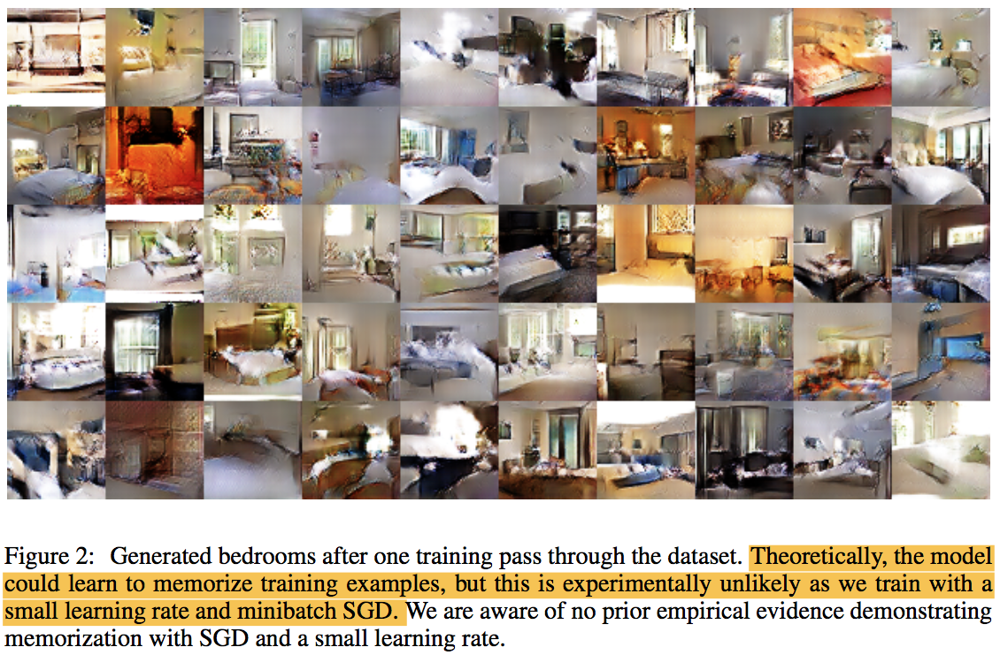
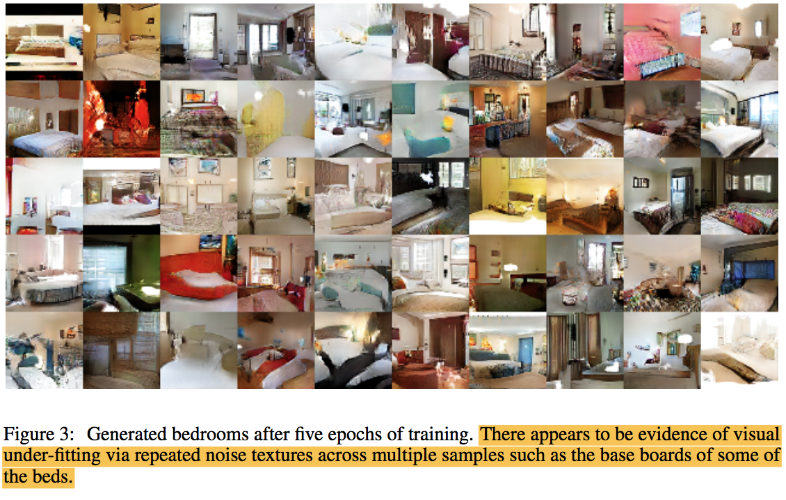
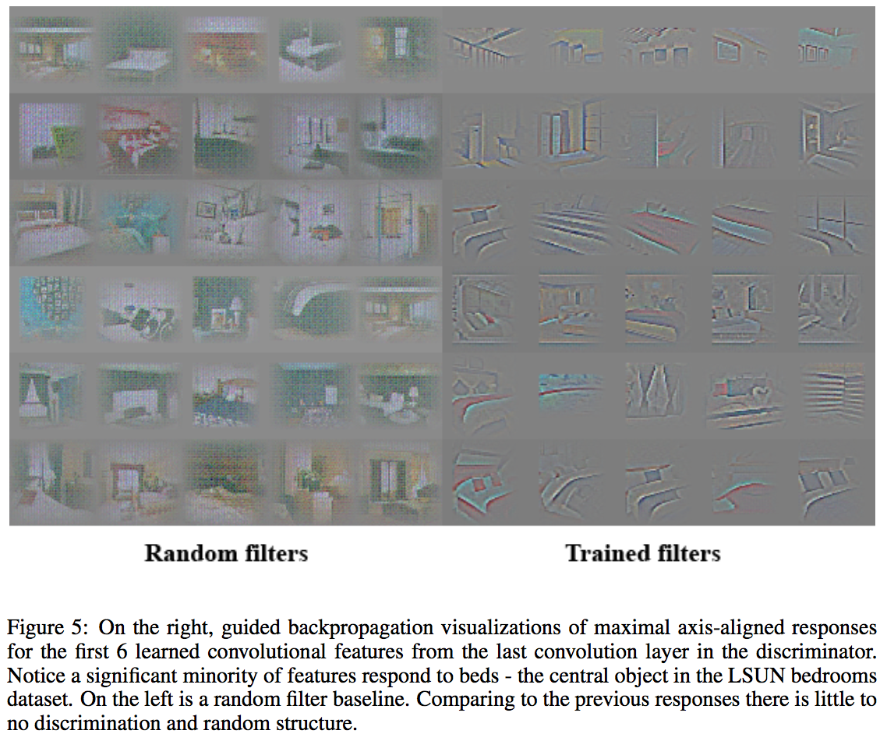
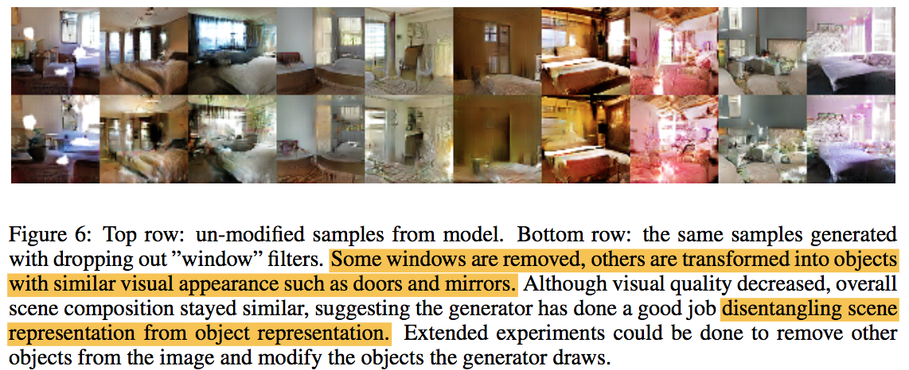
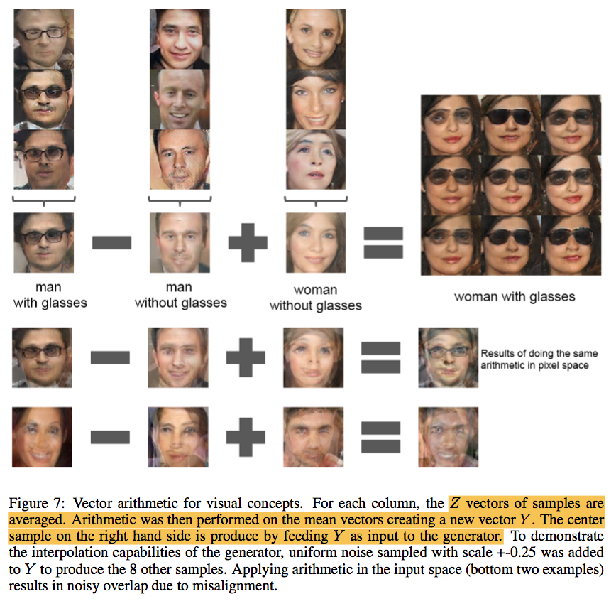

# S03-03. DCGAN

[DCGAN: Unsupervised Representation Learning with Deep Convolutional Generative Adversarial Networks](https://arxiv.org/abs/1511.06434) by Alec Radford

**reviewed by [Insoo Chung](https://github.com/1nsunym)**

## 1. 요약

- 논문에서 다루는 것
    - Supervised Learning에서 효과를 입증한 CNN을 GAN에 적용하는 방법론
    - Feature들이 잘 학습되는 지에 대한 실험(!= Overfitting)
        1. Discriminator의 feature를 활용한 classification task 적용
            * 82.8% accuracy(SOTA는 Exempler CNN의 84.3%)
        1. Discriminator의 filter visualization
            * Meaningful feature에 activate 되는 것으로 보임
        1. 특정 filter를 drop하는 실험
        1. 다양한 Interpolation 실험
    - G(z)를 만드는 z들의 vector arithmetic 실험 결과
        + c.f. (word2vec) King - Man + Woman = Queen

## 2. 내용

- Model architecture guideline
    + GAN에 CNN을 적용하려는 시도들이 있었으나 성공적이지 못했다.
    + Recent(2016) changes in CNN architecture을 적용해서 instability를 해결
        1. Pooling layer를 strided convolution로 대체한다.
        1. 마지막 단에 주로 사용되는 FC layer를 제거한다.
            - Global average pooling로 stable하게 training할 수 있으나 수렴 속도에 악영향을 끼친다.
            - A middle ground of directly connecting the highest convolutional features to the input and output respectively of the generator and discriminator worked well(?) *이해하면 수정할게요*
        1. Batch Normalization 적용
            - 모든 layer에 적용하면 sample ociliation, model instability 문제가 있다.
            - Generator output layer, discriminator input layer에만 batch normalization 미적용
        1. 적합한 activation
            - Generator layers: 모든 레이어에 ReLU 적용, 마지막 layer에만 tanh
                + Bounded activation(tanh)를 써야 training space의 color space를 더 잘 cover한다고 합니다.
            - Discriminator layers: 모든 레이어에 LeakyReLU 적용

- DCGAN Generator Outputs
    + 1 epoch 후 결과
        * 
        * 최근(2016) 연구에 따르면 빠르게 학습하는 모델은 generalization performance도 좋은 편이다.
        * 또 mini-batch SGD, 작은 learning rate로 학습했기 때문에 overfitting이 일어나기 힘들다.
    + 5 epoch 후 결과
        * 
        * 기존 GAN보다 나은 결과
        * 하얀 노이즈를 보면 오히려 underfitting이 돼 있다는 것을 알 수 있다.

- Classification Using Discriminator Features
    + Discriminator layers의 conv feature들을 사용한다.
        1. 각 layer representation -> max pooling -> 4*4 spatial grid
        2. Flatten and concat grids to 28672 vector
        3. 이를 인풋으로 linear L2-SVM을 train!
    + ImageNet1k로 학습 -> CIFAR10 task에 활용한다.(Robust하다)
    + 82.8% accuracy(SOTA는 Exempler CNN의 84.3%)

- Discriminator Filter Visualization
    + Visualize with guided back propagation.
    + 
    + Filter들이 meaningful feature에 activate 되는 것으로 보인다.

- Forgetting to Draw Certain Objects
    + Window에 bounding box를 그린 150 example들을 활용하여 window를 생성하는데 기여하는 filter들을 dropout한 실험
    + 
    + Window를 그리지 않거나 다른 물체로 그리는 와중 scene의 구도는 유지되는 것을 볼 수 있다.
        * Object와 scene의 representation을 잘 구분하는 것을 알 수 있다.

- Interpolation Experiments
    + 사진
    + 중간 이미지들: G(z_1 \* k + z_2 \* (1 - k))
        * 왼쪽 이미지 G(z_1), 오른쪽 이미지 G(z_2), 0 < k < 1
    + Smooth한 전환을 보이는 것은 overfitting이 안됐다는 증거이다.
        * 만약 overfitting이 됐다면 sharp한 변화를 보였을 것이다.

- Z-vector Arithmetics
    + word2vec arithmetic과 유사 (King - Man + Woman = Queen)
    + 